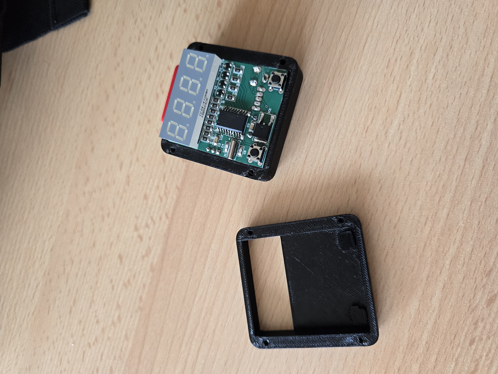

# 05-21: Initial Repository Creation & Ideas
``Aprox. 2,5 hours of research``

Created a new repository for the SkyScan project.  
I've watched videos on drone building and the INAV firmware.
- Looked into ELRS and OpenIPC for long-range control and video streaming.

Wrote down the following features I would like to accomplish:
- Under 250g due to regulations
- 4" frame
- Digital FPV with OpenIPC
- 4S battery
- GPS and Mission planning with INAV

- Looked into compatibility of OpenIPC and ELRS frequencies. Both are 2.4GHz. So I will need to use a 900MHz ELRS module to make sure that the 2.4GHz and 900MHz modules are not **interfering with each other**.
- Looked up options for the OpenIPC system. Decided to go with **Wyvern Link (Alpha) OpenIPC - 100mW VTX** for its price and good camera.

Aliexpress will be the shop I will be sourcing from — cheap shipping and a huge selection of parts. I have only good experience with Aliexpress. So there isn't another option.

Okay, a few hours later and I have actually a better option for the camera. I will be using the **Eachine Sphere Link 5.8GHz WIFI Digital HD**. Since the Wyvern Link does not support onboard recording, this will be a much better option. And I will be able to use the **5.8GHz** frequency for the video and 2.4GHz for the ELRS.

> this is the Eachine Sphere VTX  

- This was about 2.5 hours of research. I will be continuing to look into the components and their compatibility.

# 05-21: Frame, FC, Motors

I prioritized selecting the camera first because that's the main part of the drone for the actual 3D scanning.

I've continued to look up parts and I think I have a quite good combination now. I'm especially happy with the frame. It's built so the props don’t show in the camera feed. **Clear video is important!**

### As of now, I have selected the following components:

| Component                   | Details / Notes                                                                               |
| --------------------------- | --------------------------------------------------------------------------------------------- |
| **Frame**                   | **JMT LR4 169mm (4")** — supports 20x20 / 25.5x25.5mm stacks                                  |
| **Flight Controller + ESC** | **SpeedyBee F405 AIO 40A** — powerful, 25.5x25.5mm mount (fits with adapter or printed plate) |
| **Motors**                  | **T-Motor P1604 3800KV** — perfect for 4S & 4" props; great efficiency for cruising           |
| **Camera/VTX**              | **Eachine Sphere Link** — 1080p onboard DVR, MAVLink, 800mW digital FPV                       |
| **Receiver**                | **Radiomaster XR1 Nano ELRS** 2.4GHz/900MHz dual-band — fully INAV + ELRS compatible          |

> The frame I've chosen to go with  

Next steps:
- Look into the GPS recommended by the frame manufacturer, since it already has a GPS mount.
- Learn more about props and their compatibility with the motors.
- Finish with battery selection. **And establish a weight budget.**

My plan for the custom parts are legs that I will model and 3D print. I will also be using a 3D printed mount for the camera. As for custom hardware, the FC has an I2C port; I could use that for a LIDAR or RGB.

That's all for now. Will be back soon!

# 05-22: Component Selection & Weight Budget

`2 hours to school well spent :P`

Hey again, today I started working right after I got into my train. I've decided on a GPS module that will be needed for the drone to have a good position hold while taking pictures.  
The GPS should also have a magnetometer so the drone knows its direction — which the **Beitian BN-880 BN880** has.

Last night I watched a few videos and all of the featured drones had a buzzer. So I figured I might also add one, the FC supports it.

| Component  | Details / Notes                                                                                                               |
| ---------- | ----------------------------------------------------------------------------------------------------------------------------- |
| **GPS**    | **Beitian BN-880 BN880 Flight Controller GPS** — Fast and accurate, has magnetometer                                         |
| **Buzzer** | **Pixhawk PX4 Buzzer** — really compact                                                                                       |
| **Props**  | **Gemfan 4023 1.5mm 2mm 4inch 3 blade** — Good looking and in the right size. They should be made for the brand of our motors |

Now I'm looking into props. They should have a 1.5mm hole and 3 blades — 4 inch size of course.  
From what I understand the **4023** are suitable. I've chosen a **pack of 16** since they are quite fragile.

I really like this process of looking up parts and matching them with each other. It’s like building computers — but it FLIES!

With the props added it looks quite complete, just checking a few things with the seller of the drone frame so I could be sure with the dimensions. I CANT WAIT!

I will be sourcing my own batteries & controller. The software part is also what I’m looking forward to — I found some that I could modify for my 3D scanning implementation!

I will have my friend run over the parts and check some of the fitment. The VTX will have to have a custom 3D printed adapter because it’s 0.5mm off. That's no problem — I will practice my patience and CAD skills.

Also an interesting thing I found while researching RX modules and interfering frequencies — the current **Radiomaster XR1 Nano ELRS** is dual-band. So it supports both 2.4GHz and 900MHz. That means I could upgrade for longer range down the road!

Hey I'm back, 2 classes later, I've found this cute pair of lollipop antennas. They will be great for the VTX. Since the drone will be operated remotely on a monitor I would really like a good video feed. Might implement computer vision for object detection.

# 05-22/23: Final costs

`took more or less about 30 minutes`

| Parts       | Link                              |  Costs  + Shipping  |
| ----------- | --------------------------------- | :-----------------: |
| Frame       | https://a.aliexpress.com/_EvwVZDU | 730 CZK - 33.15 USD |
| VTX         | https://a.aliexpress.com/_EHbSKhC | 2350 CZK - 107 USD  |
| Motors      | https://a.aliexpress.com/_EINYVGa | 1142 CZK - 52 USD   |
| VTX Antenna | https://a.aliexpress.com/_Ev1Kqw6 |  300 CZK - 14 USD   |
| FC AIO      | https://a.aliexpress.com/_Ez89AS2 | 1330 CZK - 61 USD   |
| Buzzer      | https://a.aliexpress.com/_EHUrHM6 |   45 CZK - 2 USD    |
| Props       | https://a.aliexpress.com/_EzHnXNG |  130 CZK - 6 USD    |
| GPS         | https://a.aliexpress.com/_ExEMGLG |  600 CZK - 27 USD   |
| RX          | https://a.aliexpress.com/_ExRInKe |  335 CZK - 15 USD   |
|TOTAL||317.15 USD|

The software side will be so much fun. Im looking forward to it.

---

# 06-11: Custom Frame Modeling for 3D Printing
`2 hours of 3D modeling`

Hey, it's Wrexik again!
Since highway is about making custom parts, so it would make sense to model the frame in 3D. To get the project **approved**! Today I will gather all the measurements and dimensions of the components for the build. I will also be looking for a good 3D material to print the frame with. So far I have been more towards PETG but ABS is also a good option. 
PETG with carbon fiber would be pretty cool. But I dont know if my printer is compatible with it. I will have to check that out.

Ok, now the measurements. I will check out the camera, VTX, FC, motors and GPS.
| Component | Mounting | Diameter | Notes |
| --------- | ----------- | ----- | ------ |
| FC AIO | 25.5 x 25.5mm | 2mm | 4 x holes |
| VTX | 30.5 x 30.5mm | unknown | 4 x holes|
| Camera | 2 screws from the sides | n/a | 2 x holes, 19 x 19mm body |
| Motors | 9 x 9 mm | M2 / 2mm | 4 x holes |

Next up, making some kind of footprint for the components. To better understand the way they will fit together.
Decided to try Onshape, ive been using Plasticity for a while but I want to try something new.

Its really diferent. I have modeled the Motor and FC so far.
Now im going to model the VTC and GPS.
Here we go then... Did the GPS it will only serve as a reference for the mount. I might skip the GPS mount for now, since I will be using a 3D printed one anyway.
Onto the VTX, Echine doesnt have a good description of the dimensions, so again it will be only a refrence for the frame mounting.

They dont say if the hole is M2 or M3 so I did them as M2. I will have to check that out later. Or just add silicone feet to match the size.

Now the bigger part, the frame itself. I will choose the selected frame as a refrence, and modify it to my liking. It will be pretty basic, but I will be able to modifiy it later on and update it.
The plan is to have "Deadcat" shaped arms, for clean video without the props in the frame. And really lightweight. I have 10 minutes left of the current class, so I will get things togeter and see how it goes.

Anddd End. I've only managed to experiment with the frame. And get the initial idea.

# 06-12: More 3D Design & Frame Modeling
``1,5 hours of 3D modeling``

Ive added the propereller dimensions to make it easier to understand the layout. Ive also made the body little bit longer to fit everything in. It will also help with the center of gravity. I have to shower and go to bed, so I will continue tomorrow. But I think it looks super cool, with the rounded edges. *YEPEE*

tomorrow I will try to excrude the frame and try to print the very first prototype. Just to see the sizes and the fitment of the components. Im looking forward to it!

# 06-14: First Prototype Printed
Today I fixed some of the errors in the frame structure. The arms werent the same, I might use mirror mode next time. Ive also rounded more of the frame, it looks super cool now! When I came home from school I extruded the frame by 3mm and tryed to print it. It came in about 28g and 34m of print time. Just in PLA nothing fancy.
Next up, I will be adding the mounting holes and standofs. And the "roof" of the drone.

Ive added the mounting holes for motors and made the back of the drone longer to easily fit the gps and stuff. I will be experementing with the mounting for the motors, Ive made them ajustable. But also left the M2 holes for the non ajustable version. The prototype is printed, older version but it looks sick!

Sorry fot the image quality, my S24 Ultra broke :/.

# 06-16 More CAD! Weight reduction.

``Took some time, 3,5 of CAD and stuff``

Hey, Ive been contimuing to model the frame. Ive looked up frame models and made it how I think it could work. I had the screw dimensions wrong, should be fixed now. I still dont know the diameter of the screw hole on the VTX. In case thats wrong it could be easily fixed after I get the parts from the grant. Ive added holes for mounting the roof of the drone. It will be pretty much the same thing like on the bottom, but with more holes and grill for the VTX fan. Well he might be covered by the battery, but it should work even without it. As far as my motivation goes, Im "motimaxxed" Im doing my best with the documentation for yall. I will work on the ReadMe next. With pretty screenshots. Really praying for approval rn.
Here is the current status of the drone. I had a while to work on it in class.

I also looked up some filaments and compared PET-G CF with other options. And again again more holes! Starting with the top now, I need to figure out the camera mount. But there is also nearly to no documentation like with the VTX. Top will be mostly holes with a place to mount the strap for the battery. With im not sure also, what battery will I have to use. Some custom 18650 cells?? Also an option.

But I have no experience, cool to experiment with tho. Okay moving to the top...

Little while later I have this thing. I may ajust the holes a little more, for the battery but the dimensions I hope are correct. 

I found out that you can actually share a link, so here it is [Onshape model](https://cad.onshape.com/documents/29a5ea5b7ab0b002b2ab2d66/w/dfc60f1223006b31794c7fb2/e/e7f5c2a8a30eddbf3b560972?renderMode=0&uiState=68501575082a9427eae64d49)
I turned off exporting since I want to be the one to post **my** model to Printables :D

And we are 3d!

Ive also smoothed out the corners of the rods and some shapes to make it look smooth. 3D printing is better with way less material waste, over subtractive machining. The thing on the back is for the GPS. It isnt accurate but for now as proof of concept it will work really well. I hope this makes the project acceptable to fund me. I strugled but look what I learned! Amazing. Still Im looking forward programing it more tho :D. 

## Pitch

Hey @alexren!  
My name is Kryštof and I study IT in 🇨🇿.

I would like to pitch my idea of my little project. A month ago I was introduced to the amazing world of 3D scanning. I usually go around an object and take a ton of photos with my phone — but only where my hand can reach.

This beach scan is a good example:  
https://splatter.app/s/c07-ax0

I’ve attended the 3DISE conference in Prague and met a lot of smart people. I was fascinated by one presentation: scanning the whole Alcatraz. That wouldn't be possible without drones. Seeing the objects from the top would enable me to scan abandoned buildings and continue exploring the topic of photogrammetry and 3D gaussian splatting.

DJI has its own enterprise solution for 3D scanning — so why wouldn't we make it too, and open source it? Autonomous digitizing of buildings and sites.

**Examples of recent previous work:**  
SMD alarm clock, with 2 switches and buzzer to configure and wake you up:  

---

### What would be the build process:
1. Gather all the hardware needed.
2. 3D model a new mount for the camera and VTX adapter.
3. 3D print the rest of the frame with modification to fit the antennas.
4. Practice soldering & planning the steps.
5. Configure, Build, Code and Fly!

---

### BOM:
- Frame - 730 CZK / 33.15 USD
- VTX - 2350 CZK / 107 USD
- Motors - 1142 CZK / 52 USD
- VTX Antenna - 300 CZK / 14 USD
- FC AIO - 1330 CZK / 61 USD
- Buzzer - 45 CZK / 2 USD
- Props - 130 CZK / 6 USD
- GPS - 600 CZK / 27 USD
- RX - 335 CZK / 15 USD

---

### Why I know I can do this:
I wanted to build my own drone for a while. It is a fascinating hobby for me, and I want to get into it. And where else to start — just build one. I have pretty good knowledge in the IT software side, but this could open my heart to PCB designing and hardware.

---

### Why this deserves 10 points:
- It has quite a lot of new things for me to learn and explore.
- I think it is a unique idea, that could open this world for others like it did for me.
- I might not be making something super complex but I will be building something that was on my mind for a while. Super motivated about this.

Thanks for reading in,  
💕 Wrexik
